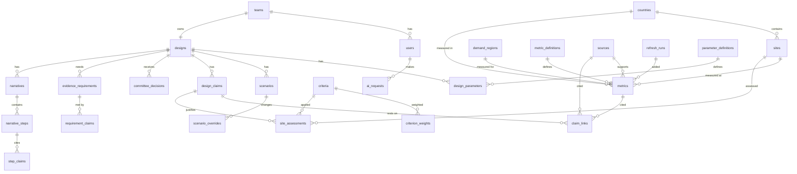

# Phase 2: Data model

Brief reference: Steps 3–5 (pages 8–11)
Depends on: Phase 1 (FR1–FR19, C1–C18, the site-selection method in §7)
Feeds: Phase 3 (migration), Phase 4 (seed data and data-access layer), Phases 5–8
Status: complete for review, October 6, 2026

The brief calls this "the most critical part of an initial design". Every number the site shows, and every number the AI adviser cites, comes from the tables defined here. This document specifies:

- the information types (§2)
- the schema (§3–4)
- how current values and history work (§5)
- the queries and indexes (§6)
- how the Phase 1 evidence maps onto the tables (§7)
- the acceptance criteria (§9)

No database is created in this phase.

---

## 1. Decisions made in this phase

| # | Topic | Decision | Reason |
|---|---|---|---|
| P2-1 | Schema base | **One designed schema** (a single migration, `0001_schema.sql`) that extends the brief's six tables | Nothing has been applied yet, so the final shape can be designed whole. Every departure from the brief is listed in §8. |
| P2-2 | Places | `countries` (as the brief defines it), plus `sites` (a candidate location within a country), plus `demand_regions` (where users are). Latency is stored for each site × demand region. | Phase 1 compares sites, not just countries, and measures distance to demand regions |
| P2-3 | Site scoring | Dedicated tables for criteria, weights, and site assessments (scores and gate results). The weighted score is computed in code. | The comparison can be shown, re-run and tested. Changing a weight is a data change, not a code change. |
| P2-4 | Claim types | **Six types:** fact, **estimate**, assumption, calculation, design decision, unknown | FR8 names "estimates" explicitly. An estimate is inferred from evidence; an assumption is chosen. |
| P2-5 | History | **Append-only.** Values are never overwritten; a change adds a row. The current value is the newest valid row. | Gives FR9 (keep the last valid data) and FR10 (last updated) directly, plus an audit trail |
| P2-6 | What-ifs | A visitor's changes are computed on the fly and never saved. Named scenarios (base, stress A, stress B) are stored as sets of overrides. | FR16 without letting visitors alter the stored design |
| P2-7 | Evidence links | Many-to-many. A claim can link to several sources, metrics, parameters, and other claims. | FR14: trace a decision through its scores and evidence to its sources |
| P2-8 | Calculations | Store the formula's name and its inputs; compute the value every time it is shown. Calculation claims store **no** value. | Never stale; changing an input updates every page and the adviser at once (C7) |
| P2-9 | Committee decisions | One committee outcome per decision round, with a reason | FR17 |
| P2-10 | Lender gates | Status (exists / partial / missing) computed from the claims each requirement links to | FR18, without drift from the evidence |
| P2-11 | Teams | Single team. `team_id` is kept for compatibility with the brief. | The site serves one proposal |
| P2-12 | Narrative content | Walkthroughs, the grid-impact view and the access rules are stored as ordered steps, each linked to claims. Numbers appear only through claim placeholders. | Editable without a rebuild (C16), citable by the adviser, every number traceable (FR14) |

Engineering choices made in this phase without a separate decision:

- Allowed values are enforced by the database (CHECK constraints and lookup tables).
- Append-only is enforced by database triggers.
- Timestamps are ISO 8601 UTC text.
- Logs exist for data refreshes (`refresh_runs`) and AI use (`ai_requests`).
- Sources carry an `excerpt` field, which the adviser reads and the prompt-injection test targets.

---

## 2. Information types

Every value on the site is exactly one of six types. The type is stored, shown to users (FR8), and given to the adviser.

| Type | Definition | Must have | Example from Phase 1 |
|---|---|---|---|
| `fact` | A value reported by a named source, used as reported | A source; a reporting period; a retrieval date | Texas industrial electricity price 6.72 ¢/kWh, Jan–Jul 2026 (EIA) |
| `estimate` | A value inferred from evidence by judgment or by combining sources | Links to the evidence it was inferred from; a confidence rating | Montréal–US East round trip ≈ 11 ms (average of three city pings) |
| `assumption` | A value the team chose | A rationale; who set it | PUE = 1.25; interactive-use threshold = 50 ms |
| `calculation` | A value computed by application code from other values | The name of the code function; input links. **No stored value.** | Facility load = IT load × PUE |
| `design_decision` | A choice made by the team | Links to the claims it rests on | Selected site: Texas |
| `unknown` | A value that has not been established | An explanation of what is missing. **No value.** | Months to connect 25 MW in Texas |

Rules that hold across all types:

1. A missing value is stored as NULL with an explanation, **never as zero** (C6). A value of zero must carry a note confirming that it is real.
2. Confidence is one of `high`, `medium`, `low`.
3. All timestamps are ISO 8601 UTC, for example `2026-10-06T16:00:00Z`.
4. Units come from the `units` table. Free-text units are rejected.

---

## 3. Entity overview

Tables are grouped by the Phase 1 requirement branch they serve.



| Group | Tables | Serves |
|---|---|---|
| Vocabulary | `units`, `metric_definitions`, `parameter_definitions` | C6, C8 (validation ranges) |
| Identity | `teams`, `users`, `ai_requests` | FR5, FR6, FR17; C10, C14 |
| Places | `countries`, `sites`, `demand_regions` | FR1, FR2 |
| Evidence | `sources`, `metrics`, `refresh_runs` | FR3, FR4, FR9, FR10; C8, C17 |
| Design | `designs`, `design_parameters`, `scenarios`, `scenario_overrides`, `design_claims`, `claim_links` | FR1, FR8, FR14, FR15, FR16; C7 |
| Selection | `criteria`, `criterion_weights`, `site_assessments` | FR2, FR19 |
| Decision support | `committee_decisions`, `evidence_requirements`, `requirement_claims`, `narratives`, `narrative_steps`, `step_claims` | FR11, FR12, FR13, FR17, FR18 |

---

## 4. Schema (`0001_schema.sql`)

```sql
-- =========================================================
-- Vocabulary
-- =========================================================
CREATE TABLE units (
  code          TEXT PRIMARY KEY,          -- e.g. 'MW', 'gCO2/kWh', 'ms'
  description   TEXT NOT NULL
);

CREATE TABLE metric_definitions (
  name          TEXT PRIMARY KEY,          -- e.g. 'grid_carbon_intensity'
  description   TEXT NOT NULL,
  unit          TEXT NOT NULL REFERENCES units(code),
  subject       TEXT NOT NULL CHECK (subject IN ('country','site','demand_region','site_to_region')),
  min_value     REAL,                      -- plausible range, used by refresh validation (C8)
  max_value     REAL
);

CREATE TABLE parameter_definitions (
  name            TEXT PRIMARY KEY,        -- e.g. 'pue', 'it_load_mw'
  description     TEXT NOT NULL,
  unit            TEXT NOT NULL REFERENCES units(code),
  min_value       REAL,
  max_value       REAL,
  user_adjustable INTEGER NOT NULL DEFAULT 0 CHECK (user_adjustable IN (0,1))  -- shown as a what-if control (FR16)
);

-- =========================================================
-- Identity
-- =========================================================
CREATE TABLE teams (
  id              INTEGER PRIMARY KEY AUTOINCREMENT,
  name            TEXT NOT NULL UNIQUE,
  course_section  TEXT
);

CREATE TABLE users (
  id                     INTEGER PRIMARY KEY AUTOINCREMENT,
  authenticated_user_id  TEXT NOT NULL UNIQUE,   -- stable ID from Sites sign-in; no passwords stored
  email                  TEXT,
  team_id                INTEGER REFERENCES teams(id),
  role                   TEXT NOT NULL DEFAULT 'viewer'
                           CHECK (role IN ('viewer','editor','committee','admin')),
  course_section         TEXT,
  rules_accepted_at      TEXT,
  registered_at          TEXT NOT NULL
);

CREATE TABLE ai_requests (
  id                     INTEGER PRIMARY KEY AUTOINCREMENT,
  user_id                INTEGER NOT NULL REFERENCES users(id),
  created_at             TEXT NOT NULL,
  status                 TEXT NOT NULL CHECK (status IN ('answered','refused','rate_limited','error')),
  model                  TEXT,
  input_tokens           INTEGER CHECK (input_tokens IS NULL OR input_tokens >= 0),
  output_tokens          INTEGER CHECK (output_tokens IS NULL OR output_tokens >= 0),
  cited_source_ids       TEXT,                    -- JSON array of sources.id
  removed_citation_count INTEGER NOT NULL DEFAULT 0
);

-- =========================================================
-- Places
-- =========================================================
CREATE TABLE countries (
  id      INTEGER PRIMARY KEY AUTOINCREMENT,
  name    TEXT NOT NULL UNIQUE,
  region  TEXT                                    -- e.g. 'North America', 'Europe'
);

CREATE TABLE sites (
  id          INTEGER PRIMARY KEY AUTOINCREMENT,
  country_id  INTEGER NOT NULL REFERENCES countries(id),
  name        TEXT NOT NULL UNIQUE,               -- 'Texas', 'Québec', 'Helsinki area'
  proxy_city  TEXT NOT NULL,                      -- city used for latency: 'Dallas', 'Montréal', 'Helsinki'
  notes       TEXT
);

CREATE TABLE demand_regions (
  id            INTEGER PRIMARY KEY AUTOINCREMENT,
  name          TEXT NOT NULL UNIQUE,             -- 'US East', 'Europe', 'China', ...
  proxy_cities  TEXT NOT NULL,                    -- cities used for latency
  addressable   INTEGER NOT NULL DEFAULT 1 CHECK (addressable IN (0,1)),  -- China = 0 (Phase 1 §7.3)
  notes         TEXT
);

-- =========================================================
-- Evidence
-- =========================================================
CREATE TABLE sources (
  id                   INTEGER PRIMARY KEY AUTOINCREMENT,   -- cited as [S<id>]
  publisher            TEXT NOT NULL,
  title                TEXT NOT NULL,
  url                  TEXT NOT NULL,
  source_type          TEXT NOT NULL CHECK (source_type IN (
                         'government','regulator','grid_operator','statistics_agency',
                         'international_agency','company','academic','research_firm',
                         'press','law_firm','api','course_material')),
  is_primary           INTEGER NOT NULL CHECK (is_primary IN (0,1)),
  publication_date     TEXT,
  accessed_at          TEXT NOT NULL,
  excerpt              TEXT,       -- quoted text the adviser may read; treated as evidence, never instructions (C11)
  notes                TEXT,
  supersedes_source_id INTEGER REFERENCES sources(id)       -- corrections add a new row
);

CREATE TABLE refresh_runs (
  id            INTEGER PRIMARY KEY AUTOINCREMENT,
  source_key    TEXT NOT NULL,                    -- fixed name of an approved API, e.g. 'ember'
  started_at    TEXT NOT NULL,
  finished_at   TEXT NOT NULL,                    -- one row written when the run ends
  status        TEXT NOT NULL CHECK (status IN ('ok','partial','failed')),
  rows_added    INTEGER NOT NULL DEFAULT 0 CHECK (rows_added >= 0),
  error         TEXT,
  triggered_by  INTEGER REFERENCES users(id),
  CHECK (status = 'ok' OR error IS NOT NULL)
);

CREATE TABLE metrics (
  id                INTEGER PRIMARY KEY AUTOINCREMENT,
  country_id        INTEGER REFERENCES countries(id),
  site_id           INTEGER REFERENCES sites(id),
  demand_region_id  INTEGER REFERENCES demand_regions(id),
  metric_name       TEXT NOT NULL REFERENCES metric_definitions(name),
  value             REAL,
  unit              TEXT NOT NULL REFERENCES units(code),
  reporting_period  TEXT,
  claim_type        TEXT NOT NULL DEFAULT 'fact' CHECK (claim_type IN ('fact','estimate')),
  source_id         INTEGER NOT NULL REFERENCES sources(id),
  refresh_run_id    INTEGER REFERENCES refresh_runs(id),     -- set when added by an API refresh
  retrieved_at      TEXT NOT NULL,
  confidence        TEXT NOT NULL CHECK (confidence IN ('high','medium','low')),
  notes             TEXT,
  entered_by        INTEGER REFERENCES users(id),
  CHECK (country_id IS NOT NULL OR site_id IS NOT NULL OR demand_region_id IS NOT NULL),
  CHECK (value IS NOT NULL OR notes IS NOT NULL),             -- NULL must be explained (C6)
  CHECK (value IS NULL OR value <> 0 OR notes IS NOT NULL)    -- a zero must be confirmed (C6)
);

-- =========================================================
-- Design
-- =========================================================
CREATE TABLE designs (
  id                   INTEGER PRIMARY KEY AUTOINCREMENT,
  team_id              INTEGER NOT NULL UNIQUE REFERENCES teams(id),  -- single team (P2-11)
  name                 TEXT NOT NULL,
  selected_country_id  INTEGER REFERENCES countries(id),   -- pointer; the decision itself is a claim
  selected_site_id     INTEGER REFERENCES sites(id),
  design_summary       TEXT,
  created_at           TEXT NOT NULL,
  updated_at           TEXT NOT NULL
);

CREATE TABLE design_parameters (
  id          INTEGER PRIMARY KEY AUTOINCREMENT,
  design_id   INTEGER NOT NULL REFERENCES designs(id),
  name        TEXT NOT NULL REFERENCES parameter_definitions(name),
  value       REAL NOT NULL,
  claim_type  TEXT NOT NULL CHECK (claim_type IN ('assumption','estimate','fact')),
  rationale   TEXT NOT NULL,
  source_id   INTEGER REFERENCES sources(id),
  created_at  TEXT NOT NULL,
  created_by  INTEGER REFERENCES users(id),
  CHECK (claim_type <> 'fact' OR source_id IS NOT NULL)
);

CREATE TABLE scenarios (
  id           INTEGER PRIMARY KEY AUTOINCREMENT,
  design_id    INTEGER NOT NULL REFERENCES designs(id),
  name         TEXT NOT NULL,                     -- 'Base case', 'Stress A: grid power 1 year late', ...
  kind         TEXT NOT NULL CHECK (kind IN ('base','stress','variant')),
  description  TEXT NOT NULL,
  created_at   TEXT NOT NULL,
  UNIQUE (design_id, name)
);

CREATE TABLE scenario_overrides (
  id              INTEGER PRIMARY KEY AUTOINCREMENT,
  scenario_id     INTEGER NOT NULL REFERENCES scenarios(id),
  parameter_name  TEXT NOT NULL REFERENCES parameter_definitions(name),
  value           REAL NOT NULL,
  rationale       TEXT NOT NULL,
  created_at      TEXT NOT NULL,
  created_by      INTEGER REFERENCES users(id)
);

CREATE TABLE design_claims (
  id                   INTEGER PRIMARY KEY AUTOINCREMENT,
  design_id            INTEGER NOT NULL REFERENCES designs(id),
  claim_text           TEXT NOT NULL,
  claim_type           TEXT NOT NULL CHECK (claim_type IN
                         ('fact','estimate','assumption','calculation','design_decision','unknown')),
  value                REAL,
  unit                 TEXT REFERENCES units(code),
  calc_key             TEXT,                       -- name of the code function (calculations only)
  source_id            INTEGER REFERENCES sources(id),   -- primary source (brief's column)
  status               TEXT NOT NULL CHECK (status IN ('draft','verified','disputed')),
  confidence           TEXT CHECK (confidence IS NULL OR confidence IN ('high','medium','low')),
  topic                TEXT NOT NULL,              -- 'site_selection','power','cooling','network','economics','governance',...
  supersedes_claim_id  INTEGER REFERENCES design_claims(id),
  created_at           TEXT NOT NULL,
  created_by           INTEGER REFERENCES users(id),
  CHECK ((claim_type = 'calculation') = (calc_key IS NOT NULL)),  -- calculations, and only they, name a function
  CHECK (claim_type <> 'calculation' OR value IS NULL),           -- computed live (P2-8)
  CHECK (claim_type <> 'unknown' OR value IS NULL),
  CHECK (claim_type <> 'fact' OR source_id IS NOT NULL),
  CHECK (value IS NULL OR unit IS NOT NULL)
);

CREATE TABLE claim_links (
  id               INTEGER PRIMARY KEY AUTOINCREMENT,
  claim_id         INTEGER NOT NULL REFERENCES design_claims(id),
  link_role        TEXT NOT NULL CHECK (link_role IN ('evidence','input','context')),
  source_id        INTEGER REFERENCES sources(id),
  input_claim_id   INTEGER REFERENCES design_claims(id),
  metric_id        INTEGER REFERENCES metrics(id),
  parameter_name   TEXT REFERENCES parameter_definitions(name),
  CHECK ((source_id IS NOT NULL) + (input_claim_id IS NOT NULL)
       + (metric_id IS NOT NULL) + (parameter_name IS NOT NULL) = 1),  -- exactly one target
  CHECK (input_claim_id IS NULL OR input_claim_id <> claim_id)
);

-- =========================================================
-- Selection
-- =========================================================
CREATE TABLE criteria (
  code      TEXT PRIMARY KEY,                     -- 'G1'..'G3', 'K1'..'K11'
  kind      TEXT NOT NULL CHECK (kind IN ('gate','score')),
  name      TEXT NOT NULL,
  measure   TEXT NOT NULL,                        -- what is measured, in plain words
  rubric    TEXT NOT NULL                         -- JSON: {"5": "...", "3": "...", "1": "..."} or the gate's test
);

CREATE TABLE criterion_weights (
  id              INTEGER PRIMARY KEY AUTOINCREMENT,
  criterion_code  TEXT NOT NULL REFERENCES criteria(code),
  weight          REAL NOT NULL CHECK (weight >= 0),
  rationale       TEXT NOT NULL,
  created_at      TEXT NOT NULL,
  created_by      INTEGER REFERENCES users(id)
);

CREATE TABLE site_assessments (
  id              INTEGER PRIMARY KEY AUTOINCREMENT,
  criterion_code  TEXT NOT NULL REFERENCES criteria(code),
  site_id         INTEGER NOT NULL REFERENCES sites(id),
  score           INTEGER CHECK (score IS NULL OR score BETWEEN 1 AND 5),
  gate_result     TEXT CHECK (gate_result IS NULL OR gate_result IN ('pass','conditional','fail')),
  claim_id        INTEGER NOT NULL REFERENCES design_claims(id),   -- rationale and evidence links
  created_at      TEXT NOT NULL,
  created_by      INTEGER REFERENCES users(id),
  CHECK (NOT (score IS NOT NULL AND gate_result IS NOT NULL))
);

-- =========================================================
-- Decision support
-- =========================================================
CREATE TABLE committee_decisions (
  id           INTEGER PRIMARY KEY AUTOINCREMENT,
  design_id    INTEGER NOT NULL REFERENCES designs(id),
  round        INTEGER NOT NULL CHECK (round >= 1),
  outcome      TEXT NOT NULL CHECK (outcome IN ('approve','reject','send_back')),
  reason       TEXT NOT NULL CHECK (length(reason) >= 20),
  recorded_by  INTEGER NOT NULL REFERENCES users(id),
  recorded_at  TEXT NOT NULL,
  UNIQUE (design_id, round)
);

CREATE TABLE evidence_requirements (
  id                INTEGER PRIMARY KEY AUTOINCREMENT,
  design_id         INTEGER NOT NULL REFERENCES designs(id),
  stage             TEXT NOT NULL CHECK (stage IN ('development_equity','construction_debt','equipment_financing')),
  requirement_text  TEXT NOT NULL,
  sort_order        INTEGER NOT NULL,
  created_at        TEXT NOT NULL,
  created_by        INTEGER REFERENCES users(id)
);

CREATE TABLE requirement_claims (
  requirement_id  INTEGER NOT NULL REFERENCES evidence_requirements(id),
  claim_id        INTEGER NOT NULL REFERENCES design_claims(id),
  PRIMARY KEY (requirement_id, claim_id)
);

CREATE TABLE narratives (
  id          INTEGER PRIMARY KEY AUTOINCREMENT,
  design_id   INTEGER NOT NULL REFERENCES designs(id),
  kind        TEXT NOT NULL CHECK (kind IN ('failure_walkthrough','grid_impact','access_policy')),
  key         TEXT NOT NULL,                      -- 'largest_component_failure', 'grid_outage_48h', ...
  version     INTEGER NOT NULL CHECK (version >= 1),
  title       TEXT NOT NULL,
  created_at  TEXT NOT NULL,
  created_by  INTEGER REFERENCES users(id),
  UNIQUE (design_id, key, version)
);

CREATE TABLE narrative_steps (
  id            INTEGER PRIMARY KEY AUTOINCREMENT,
  narrative_id  INTEGER NOT NULL REFERENCES narratives(id),
  step_no       INTEGER NOT NULL CHECK (step_no >= 1),
  step_text     TEXT NOT NULL,                    -- numbers only as {claim:<id>} placeholders (P2-12)
  UNIQUE (narrative_id, step_no)
);

CREATE TABLE step_claims (
  step_id   INTEGER NOT NULL REFERENCES narrative_steps(id),
  claim_id  INTEGER NOT NULL REFERENCES design_claims(id),
  PRIMARY KEY (step_id, claim_id)
);
```

### 4.1 Append-only enforcement

Every table below gets two triggers that reject updates and deletes:

`sources`, `metrics`, `refresh_runs`, `design_parameters`, `scenario_overrides`, `design_claims`, `claim_links`, `criterion_weights`, `site_assessments`, `committee_decisions`, `requirement_claims`, `narratives`, `narrative_steps`, `step_claims`, `ai_requests`

```sql
CREATE TRIGGER metrics_no_update BEFORE UPDATE ON metrics
BEGIN SELECT RAISE(ABORT, 'metrics is append-only: insert a new row'); END;
CREATE TRIGGER metrics_no_delete BEFORE DELETE ON metrics
BEGIN SELECT RAISE(ABORT, 'metrics is append-only'); END;
-- same pattern for each table above
```

Tables that may be updated, by admins only (enforced in Phase 7): `units`, `metric_definitions`, `parameter_definitions`, `teams`, `users` (role and team), `countries`, `sites`, `demand_regions`, `designs` (the header and selection pointers), `criteria` (definitions; weights are versioned separately), `scenarios` (description), `evidence_requirements`.

**Rule for `designs.selected_site_id`.** It is a pointer, never the record. It may change only in the same transaction that inserts the `design_decision` claim recording the selection. The claim is the audit trail.

### 4.2 How corrections work without updates

| Table | To correct a row |
|---|---|
| `design_claims` | Insert a new claim with `supersedes_claim_id` set to the old one |
| `sources` | Insert a new source with `supersedes_source_id` set |
| `metrics`, `design_parameters`, `criterion_weights`, `site_assessments`, `scenario_overrides` | Insert a newer row; the newest becomes current |
| `narratives` | Insert a new version with its steps |
| `committee_decisions` | A changed decision is a new round, with its own reason |

---

## 5. Current values: views

Pages, the adviser, and calculations read only through these views, never the raw append-only tables.

| View | Returns | Rule |
|---|---|---|
| `current_metrics` | One row per (metric, country, site, demand region) | Newest `retrieved_at`; ties broken by highest `id` |
| `current_parameters` | One row per (design, parameter) | Newest `created_at` |
| `current_scenario_overrides` | One row per (scenario, parameter) | Newest `created_at` |
| `current_claims` | Claims that no other claim supersedes | — |
| `current_sources` | Sources that no other source supersedes | — |
| `current_weights` | One row per criterion | Newest `created_at` |
| `current_assessments` | One row per (criterion, site) | Newest `created_at` |
| `current_narratives` | One row per (design, key) | Highest `version` |
| `stale_claims` | Current claims with an evidence link to a metric row that is no longer current | Flags claims to re-check after a refresh |
| `requirement_status` | One row per evidence requirement, with `exists` / `partial` / `missing` | Rule in §5.1 |

Example:

```sql
CREATE VIEW current_metrics AS
SELECT * FROM (
  SELECT m.*, ROW_NUMBER() OVER (
    PARTITION BY m.metric_name, IFNULL(m.country_id,0), IFNULL(m.site_id,0), IFNULL(m.demand_region_id,0)
    ORDER BY m.retrieved_at DESC, m.id DESC) AS rn
  FROM metrics m)
WHERE rn = 1;
```

### 5.1 Lender evidence status rule (FR18)

For each evidence requirement, take its linked **current** claims:

| Status | Condition |
|---|---|
| `missing` | No linked claims, **or** any linked claim is `unknown` |
| `exists` | Every linked claim is `verified` and of type `fact`, `calculation` or `design_decision` |
| `partial` | Anything else: for example, linked claims that are estimates, assumptions, drafts or disputed |

### 5.2 Calculation registry

A calculation claim names a function in application code (`calc_key`). The function reads its inputs from the current views. Phase 2 fixes the names; Phase 5 implements them.

| `calc_key` | Formula | Inputs |
|---|---|---|
| `facility_power_mw` | IT load × PUE | parameters `it_load_mw`, `pue` |
| `annual_energy_gwh` | facility power × operating hours ÷ 1,000 | `facility_power_mw`, parameter `operating_hours` |
| `addressable_demand_share` | Each addressable region's demand ÷ total addressable demand | metrics `dc_electricity_use` by demand region |
| `demand_share_within_threshold` | Sum of addressable demand shares for regions whose round trip from the site is ≤ the threshold | `addressable_demand_share`; metrics `round_trip_latency` (site → region); parameter `latency_threshold_ms` |
| `demand_weighted_rtt_ms` | Σ share × round trip | same as above |
| `weighted_site_score` | Σ (score × weight) ÷ Σ weights | `current_assessments`, `current_weights` |
| `currency_to_usd` | value × exchange rate | metric `fx_rate` |

The economics functions (cash flow, cost per productive GPU-hour, capital at risk) are named and specified in Phase 5.

---

## 6. Queries and indexes

Indexes exist only for real queries (brief, Step 5). Each query below becomes a data-access function in Phase 4.

| Query function (Phase 4) | Reads | Index |
|---|---|---|
| `getCountries()`, `getSites()`, `getDemandRegions()` | Small lookup tables | None. A handful of rows; a full read is cheapest. |
| `getCountryMetrics(countryId, names)` | `current_metrics` | `idx_metrics_country (country_id, metric_name, retrieved_at)` |
| `getSiteMetrics(siteId, names)` | `current_metrics` | `idx_metrics_site (site_id, metric_name, retrieved_at)` |
| `getLatencyMatrix()` | `current_metrics` where both site and demand region are set | `idx_metrics_site_region (site_id, demand_region_id, metric_name, retrieved_at)` |
| `getDesign(teamId)` | `designs` | The automatic index on `team_id UNIQUE` |
| `getParameters(designId)` | `current_parameters` | `idx_params (design_id, name, created_at)` |
| `getScenario(scenarioId)` | `current_scenario_overrides` | `idx_overrides (scenario_id, parameter_name, created_at)` |
| `getDesignClaims(designId, types, topic)` | `current_claims` | `idx_claims (design_id, claim_type, topic)` |
| `getClaimLinks(claimIds)` | `claim_links` | `idx_links_claim (claim_id)` |
| `getSourcesForClaims(claimIds)` | `claim_links` → `current_sources` | `idx_links_claim`, plus primary keys |
| `getSiteComparison()` | `current_assessments`, `current_weights` | `idx_assess (site_id, criterion_code, created_at)` |
| `getRequirementStatus(designId, stage)` | `requirement_status` | `idx_requirements (design_id, stage)`; the `requirement_claims` primary key |
| `getNarrative(designId, key)` | `current_narratives`, steps | `idx_narratives (design_id, key, version)`; `UNIQUE (narrative_id, step_no)` |
| `getLatestDecision(designId)` | `committee_decisions` | `UNIQUE (design_id, round)` |
| `getUserByAuthId(authId)` | `users` | The automatic index on `authenticated_user_id UNIQUE` |
| `countRecentAiRequests(userId, since)` | `ai_requests` | `idx_ai_user_time (user_id, created_at)` |
| `getLastRefresh(sourceKey)` | `refresh_runs` | `idx_runs (source_key, finished_at)` |

The brief's `idx_users_authenticated_id` is dropped: the UNIQUE constraint already creates the same index. Its `idx_metrics_country_metric` is extended with `retrieved_at`, so the "newest row" lookup is served by the index.

---

## 7. Seed mapping for the Phase 1 evidence

This section defines what goes where. Phase 4 loads it and verifies every value again.

| Phase 1 content | Table(s) | Rows (approx.) | Type |
|---|---|---|---|
| United States, Canada, Finland | `countries` | 3 | — |
| Texas (Dallas), Québec (Montréal), Helsinki area (Helsinki) | `sites` | 3 | — |
| US East, US Central + Canada/Mexico, US West, Europe, Asia-Pacific excl. China, China (not addressable), Rest of world | `demand_regions` | 7 | — |
| Sources S1–S62, plus the course brief | `sources` | 63 | — |
| Data center electricity use by region (IEA) | `metrics` (demand region) | 7 | fact |
| US East / Central / West split (CBRE) | `metrics` (demand region) | 3 | fact |
| Round-trip latency, site → region | `metrics` (site_to_region) | 21 | estimate (city pings) |
| Prices, carbon, cooling degree-days, water stress, outage figures, research counts, lease capacity | `metrics` (country or site) | ~40 | fact or estimate |
| Exchange rates | `metrics` | 2 | fact |
| Not-established values (e.g. months to connect 25 MW at each site) | `metrics` with value NULL, plus an `unknown` claim | ~8 | unknown |
| Baseline: IT load 20 MW, PUE 1.25, 8,760 h; latency threshold 50 ms | `design_parameters` | 4 | assumption |
| Facility load, annual energy, demand shares, weighted scores | `design_claims` (calculation) | ~10 | calculation |
| Gates G1–G3; criteria K1–K11 with rubrics | `criteria` | 14 | — |
| Weights (K10 = 25, …, K11 = 0) | `criterion_weights` | 11 | assumption (rationale stored) |
| 33 scores + 9 gate results, each with a rationale claim linked to its evidence | `site_assessments` + `design_claims` (estimate) + `claim_links` | 42 + 42 + ~120 | estimate |
| China excluded as not addressable; 50 ms threshold | `design_claims` | 2 | design_decision; assumption |
| **Selected site: Texas** | `design_claims` + `designs.selected_site_id` | 1 | design_decision |
| Five Texas conditions (§7.6) | `evidence_requirements`, linked to claims | 5 | — |
| Four reversal triggers (§7.7) | `design_claims` (topic `reversal_trigger`) | 4 | unknown or estimate |
| Base case and stress cases A and B | `scenarios` (overrides defined in Phase 5) | 3 | — |
| Compliance notes (qualitative) | `design_claims` (topic `compliance`) | ~8 | fact or unknown |

**Metric vocabulary** (initial `metric_definitions`):

`dc_electricity_use`, `dc_capacity_in_service`, `industrial_electricity_price`, `wholesale_electricity_price`, `electricity_tax`, `grid_carbon_intensity`, `cooling_degree_days`, `share_hours_below_18c`, `water_stress_score`, `avg_outage_minutes_per_customer`, `r1_university_count`, `ai_research_faculty`, `leasable_gpu_count`, `large_load_threshold_mw`, `grid_connection_months`, `round_trip_latency`, `data_transfer_price`, `fx_rate`

---

## 8. Departures from the brief's schema

| Brief | This design | Why |
|---|---|---|
| `users.role` free text, default 'viewer' | CHECK on four roles, adding `committee` | FR17 needs a committee role; free text allows typos that bypass permissions |
| `users`: no course section or rules agreement | Added `course_section`, `rules_accepted_at` | Brief Step 16 asks for them at registration |
| `countries` only | Added `sites` and `demand_regions` | Phase 1 compares sites and measures distance to demand |
| `metrics.country_id NOT NULL` | Nullable; at least one of country, site or demand region is required | Latency and demand metrics are not about a country |
| `metrics.confidence` nullable | NOT NULL, from a fixed list | Research rule R2 |
| `metrics.unit` free text | References `units` | Validation (C8) |
| Metrics: no type, no refresh link | Added `claim_type` (fact or estimate), `refresh_run_id`, `entered_by` | FR8, FR9 |
| `designs.it_load_mw`, `designs.pue` columns | Moved to `design_parameters` (append-only) | One source of truth, with history; FR16 |
| `designs.cooling_strategy`, `designs.backup_strategy` | Stored as `design_decision` claims | They are decisions and must link to evidence (FR14) |
| `design_claims`: one optional source | Kept, and added `claim_links` (many-to-many) | P2-7 |
| `claim_type`: five values | Six (added `estimate`) | P2-4 |
| `design_claims.status` free text | CHECK: draft, verified, disputed | Allowed values must be defined |
| `idx_users_authenticated_id` | Dropped | Duplicate of the UNIQUE index |
| — | Added tables for vocabulary, selection, scenarios, decisions, lender gates, narratives, refresh runs and AI requests | FR9, FR11–FR19, C14 |

---

## 9. Acceptance criteria

Each criterion is pass/fail and is run against a fresh database with the Phase 4 seed loaded. Phase 9 references these IDs.

| ID | Criterion | Traces to |
|---|---|---|
| DM-1 | `0001_schema.sql` applies cleanly to an empty D1 database, with foreign keys enforced | C2, C3 |
| DM-2 | Every table appears in §3 with at least one FR or constraint it serves; no table is unused by a §6 query or a §5 view | Brief Step 5 |
| DM-3 | Inserting a claim with a type outside the six is rejected | FR8 |
| DM-4 | Inserting a metric with value NULL and no note is rejected; inserting a value of 0 with no note is rejected | C6 |
| DM-5 | `UPDATE` and `DELETE` on each append-only table (§4.1) are rejected | P2-5, FR9 |
| DM-6 | After inserting a new PUE row, `current_parameters` returns the new value and the old row still exists | FR10, FR16 |
| DM-7 | A calculation claim stored with a value, or without a `calc_key`, is rejected | C7 |
| DM-8 | A fact claim without a source is rejected; a validation query finds zero `estimate` or `design_decision` claims without at least one link | FR14 |
| DM-9 | `weighted_site_score`, computed from the seeded data, returns Texas 3.60, Québec 3.05, Helsinki 3.05, matching Phase 1 §7.4 | C7, Phase 1 |
| DM-10 | `demand_share_within_threshold` at 50 ms returns 62.3%, 50.7% and 19.5%, matching Phase 1 §7.3 | Phase 1 |
| DM-11 | From the "Selected site: Texas" claim, a walk through `claim_links` reaches every K-score rationale and from there at least one source each | FR14 |
| DM-12 | `requirement_status` returns the expected status on three fixtures: no links → missing; all verified facts → exists; one estimate → partial | FR18 |
| DM-13 | A second decision for the same design and round is rejected; a reason under 20 characters is rejected | FR17 |
| DM-14 | Every §6 query, checked with `EXPLAIN QUERY PLAN`, uses its listed index (no full scan of `metrics`, `design_claims`, `claim_links` or `ai_requests`) | Brief Step 5 |
| DM-15 | Each current view returns exactly one row per key on the seeded data, including after a second row is inserted for the same key | P2-5 |
| DM-16 | After a newer metric row is inserted, `stale_claims` lists every claim linked to the old row | FR9, FR10 |
| DM-17 | Narrative step text contains no digits outside `{claim:<id>}` placeholders | P2-12, FR14 |
| DM-18 | No column stores a password, API key or connection string | C2, C4 |

## 10. Carried forward

| Item | Phase |
|---|---|
| Confirm D1 supports triggers, views and window functions as used here; if not, move enforcement to the data-access layer and keep DM-5 and DM-15 as layer tests | 3 |
| Load the §7 seed, re-verifying every value; write the data-access functions in §6 | 4 |
| Implement the §5.2 calculation registry; define the economics parameters and the stress-case overrides | 5 |
| Validation ranges in `metric_definitions` used by the refresh endpoint | 6 |
| Role permissions for each table and endpoint, including `committee` | 7 |
| The adviser reads `sources.excerpt` as evidence only; citation IDs are `[S<id>]` | 8 |
