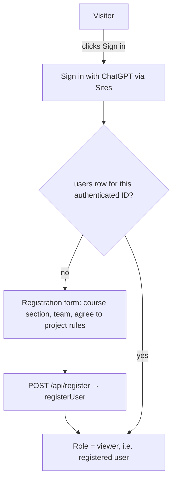

# Phase 7: Add registration and authorization

Brief reference: Steps 16–17 (pages 17–18)
Depends on: Phase 3 (routes); can run in parallel with Phase 6
Produces: Sign in with ChatGPT, a first-visit registration form, role checks on every protected endpoint
Status: draft

## Goal

Separate two questions and answer both on the server:

- **Authentication:** who is this visitor? (Sites sign-in)
- **Authorization:** what is this visitor allowed to do? (the `users` row and its role)

## 1. Sign-in and registration flow

- Store `authenticated_user_id`, which is the stable ID Sites provides. **Store no passwords**; the table is for registration only.
- Store email only if Sites supplies it and the team needs it.
- Course section and team are new fields. Add `course_section` to `users`, or keep it in `teams` (Phase 2, G1). Agreement to the rules needs a timestamp, `rules_accepted_at`, added in migration 0002.

## 2. Roles

The brief suggests four roles. The `users.role` column defaults to `'viewer'`, but the brief's lowest role, "Visitor", is someone **without** a row. To avoid confusion we map the names as follows.

| Brief role | Stored `role` value | Who | Can |
|---|---|---|---|
| Visitor | *(no users row)* | Anyone | View the public design and evidence |
| Registered user | `viewer` | Signed in and registered | Use the AI adviser |
| Editor | `editor` | Team members who maintain data | Add or refresh evidence |
| Team administrator | `admin` | One or two per team | Modify design assumptions; assign roles |

Each role includes the permissions of the roles above it.

## 3. Server-side enforcement matrix

The brief says hiding the chat box is not enough: each endpoint must check identity and registration itself.

| Endpoint | Not signed in | Signed in, not registered | `viewer` | `editor` | `admin` |
|---|---|---|---|---|---|
| Public pages (GET) | 200 | 200 | 200 | 200 | 200 |
| `POST /api/register` | 401 | 200 | 409 (already registered) | 409 | 409 |
| `POST /api/ask` | 401 | 403 + "registration required" | 200 | 200 | 200 |
| `POST /api/refresh` | 401 | 403 | 403 | 200 | 200 |
| `POST /api/metrics` (manual add) | 401 | 403 | 403 | 200 | 200 |
| `POST /api/design` | 401 | 403 | 403 | 403 | 200 |
| `POST /api/roles` | 401 | 403 | 403 | 403 | 200 (own team only) |

Implement this as one function, `requireRole(request, minimumRole)`, called first in every protected handler. It returns the user row or throws 401/403. No handler does its own ad-hoc check.

## 4. Bootstrapping the first admin

Someone has to be the first `admin`. Options:

- A one-off seed statement that sets the first team member's role by their authenticated ID (recommended)
- An allow-list secret

Never "the first person to register becomes admin".

## Done when

- [ ] Signed-out users see all public pages
- [ ] Signed-out calls to `/api/ask` return 401, even with the UI bypassed (e.g. a direct request)
- [ ] A signed-in, unregistered user is sent to the registration form; `/api/ask` returns 403
- [ ] After registering, the adviser works
- [ ] A `viewer` calling `/api/refresh` or `/api/design` gets 403
- [ ] All protected handlers call `requireRole` (verified by a grep)

## Open decisions

1. Where course section and rules agreement live (the `users` columns or `teams`), in migration 0002
2. Can admins change roles in other teams? Recommend no.
