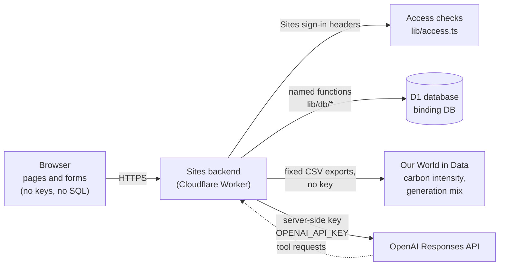

# Architecture, request path, and sources

Submission items 2 (architecture diagram), 3 (D1 schema) and 4 (external sources and APIs), plus the reference trace for item 9. Draft for human review, October 6, 2026.

## 1. System diagram

- **Browser.** Renders the pages and posts questions and forms. It holds no key and sends no SQL.
- **Sites backend.** Every page and route runs here. It reads the D1 binding `DB` and the hosted secret `OPENAI_API_KEY`. Neither is sent to the browser.
- **Access checks.** `requireRole()` in `lib/access.ts` reads the Sites sign-in headers and then the `users` row. Sign-in identifies the visitor; the `users` row and its role decide what they may do.
- **D1.** Evidence, assumptions, calculations, design decisions, user registrations, refresh runs, adviser audit rows and committee decisions.
- **External API.** Two fixed chart exports from Our World in Data. A caller cannot supply a URL.
- **OpenAI.** Called only by `/api/ask`, with the server-side key. The model can request five read-only tools; the backend runs them against D1 or the fixed external adapter.

## 2. One question, from browser to D1 to OpenAI and back

This is the brief's Step 24 sequence, with the file and function that does each step. It is a reference for the individual explanations (submission item 9); each student should write their own.

| # | Step | Where |
|---|---|---|
| 1 | A registered user types a question on `/adviser`. The browser sends only the question and the last two exchanges. | `components/adviser-chat.tsx`, `ask()` → `POST /api/ask` |
| 2 | The backend confirms the visitor is **signed in** (Sites sign-in headers) and **registered** (`users` row), before reading the request body. | `app/api/ask/route.ts` → `requireRole(request, 'viewer')` in `lib/access.ts` → `getChatGPTUser()`, `getMember()` |
| 3 | It checks size and format, and refuses with a clear message if no key is configured. | `validateAdviserInput()` in `lib/adviser.ts` |
| 4 | **Rate limit.** One SQL statement checks the hourly, daily and team token limits and reserves budget, so simultaneous requests cannot both slip through. | `reserveAdviserRequest()` in `lib/db/adviser.ts`; table `adviser_request_slots` |
| 5 | It retrieves the **current design** and the **claims relevant to the question** from D1, with their source records. | `adviserRepository(teamId).design()` and `.claims()` in `lib/db/adviser.ts` |
| 6 | It labels any instruction-like text inside the evidence as untrusted data, and keeps the evidence under a fixed size. | `sanitizeEvidence()`, `remember()` in `lib/adviser.ts` |
| 7 | It calls OpenAI with the **agent instructions**, the evidence, the question, the five tool definitions and the server-side key. | `runAdviser()` in `lib/adviser.ts` → `openAIAdviser()` in `lib/adviser-openai.ts` |
| 8 | If the model asks for a tool, the backend runs it: `get_design`, `get_country_metrics`, `get_design_claims`, `calculate_energy` (calculated in code), or `query_approved_external_source` (Our World in Data only). The result goes back to the model. At most four rounds. | `executeAdviserTool()` in `lib/adviser.ts` |
| 9 | The model returns Answer / Evidence used / Assumptions / Uncertainty. The backend re-reads every cited source ID from D1 and removes any ID that is invented or that the model was not shown. | `verifyAdviserCitations()` in `lib/adviser.ts`; `getAdviserSources()` in `lib/db/adviser.ts` |
| 10 | It records an audit row (status, model, tokens, cited IDs) and releases unused reserved tokens. | `finishAdviserRequest()` in `lib/db/adviser.ts`; table `ai_requests` |
| 11 | The browser shows the four sections, with each `[S#]` linked to its source record on `/evidence`. | `components/adviser-chat.tsx` |

Other protected paths use the same check in step 2 with a higher role:

| Path | Minimum role | Route |
|---|---|---|
| Refresh live electricity data | Editor | `app/api/refresh/route.ts` |
| Add a sourced metric | Editor | `app/api/metrics/route.ts` |
| Change design assumptions | Team administrator | `app/api/design/route.ts` |
| Assign roles | Team administrator | `app/api/roles/route.ts` |
| Record approve / reject / send back | Committee member only | `app/api/decisions/route.ts` |

## 3. External sources and APIs

| Source | How it is used | Key | Where |
|---|---|---|---|
| Our World in Data, "Carbon intensity of electricity" chart export (data credited to Ember) | Live refresh and the adviser's approved external tool | None | `lib/sources/owid.ts` |
| Our World in Data, "Share of electricity by source" chart export | As above | None | `lib/sources/owid.ts` |
| OpenAI Responses API | The adviser only | Hosted secret `OPENAI_API_KEY`, configured by the instructor | `lib/adviser-openai.ts` |
| 63 curated source records (62 research and statistics publications, 1 course document) | Seeded evidence behind claims and metrics | — | `seed/data/sources.json`; listed on `/evidence#source-catalog` |

None of the 63 seeded sources is yet marked as checked by a named person. The brief asks for at least three human-verified records (see `requirements-traceability.md`, E2).

## 4. D1 schema

Defined in `db/schema.ts`. The migrations are `drizzle/0001_schema.sql`, `0002_seed_metadata.sql` and `0003_adviser_request_slots.sql`; an applied migration is never edited.

| Group | Tables |
|---|---|
| The brief's six | `users`, `countries`, `metrics`, `sources`, `designs`, `design_claims` |
| Vocabulary | `units`, `metric_definitions`, `parameter_definitions` |
| Places | `sites`, `demand_regions` |
| Design and scenarios | `teams`, `design_parameters`, `scenarios`, `scenario_overrides` |
| Site selection | `criteria`, `criterion_weights`, `site_assessments` |
| Evidence links and content | `claim_links`, `evidence_requirements`, `requirement_claims`, `narratives`, `narrative_steps`, `step_claims` |
| Operations | `refresh_runs`, `ai_requests`, `adviser_request_slots`, `committee_decisions`, `seed_runs` |

Fifteen evidence tables are append-only: a database trigger refuses any edit or deletion, so a change is a new row and history is kept. Views such as `current_parameters` and `current_claims` return the latest row.
